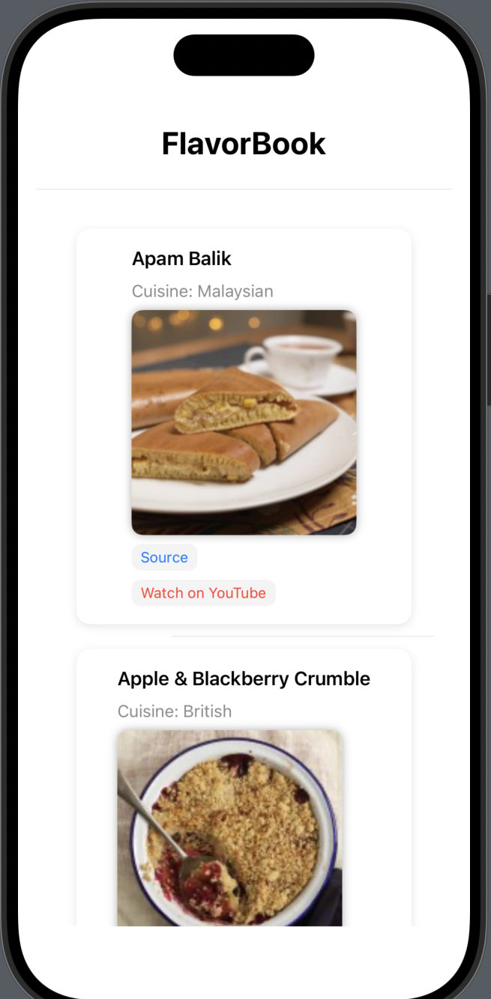

# Fetch iOS Take Home Assessment

### Summary: Include screen shots or a video of your app highlighting its features

### Focus Areas: What specific areas of the project did you prioritize? Why did you choose to focus on these areas?
- I prioritized implementing lazy image loading and a lot of error handling to optimize the user experience. I focused on this because its key to handle all cases to ensure the application does not crash.

### Time Spent: Approximately how long did you spend working on this project? How did you allocate your time?
- I spent about 4-6 hours on the project, focusing most of my time on debugging, implmenting the api, and refining the UI.

### Trade-offs and Decisions: Did you make any significant trade-offs in your approach?
- I chose to use SwiftUI’s AsyncImage for simplicity, even though it limits how advanced you can get it was a good start for the instructions.

### Weakest Part of the Project: What do you think is the weakest part of your project?
- The weakest part might be the lack of advanced image caching.

### Additional Information: Is there anything else we should know? Feel free to share any insights or constraints you encountered.
